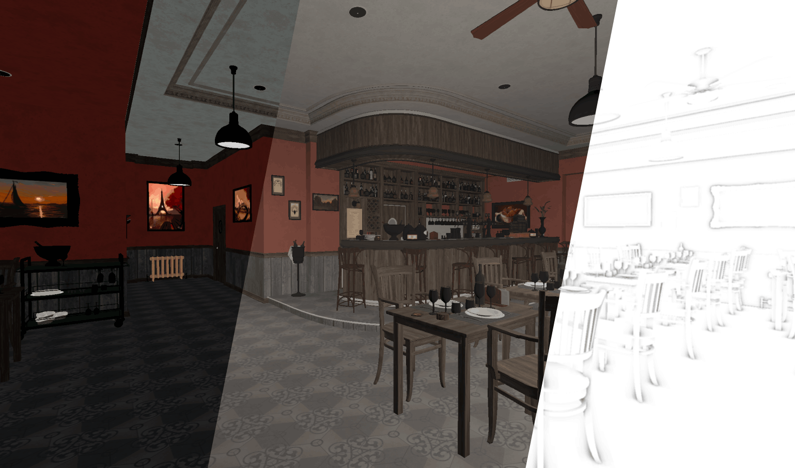
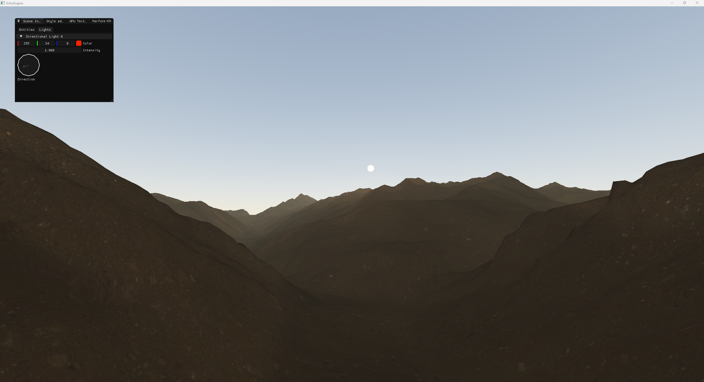
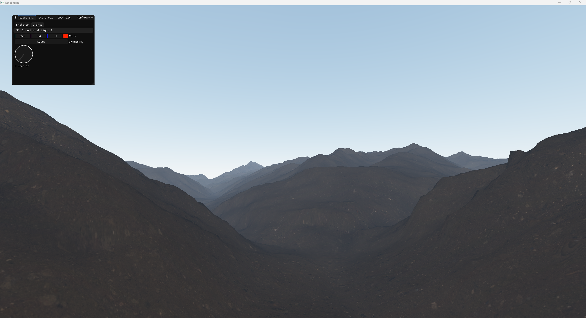
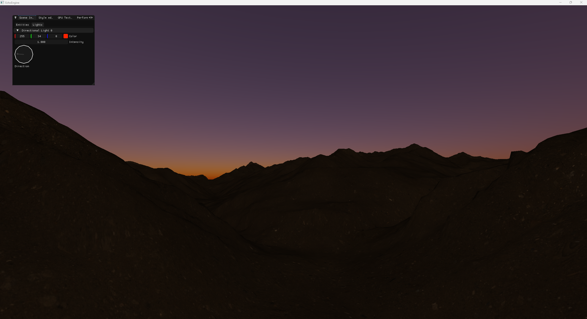
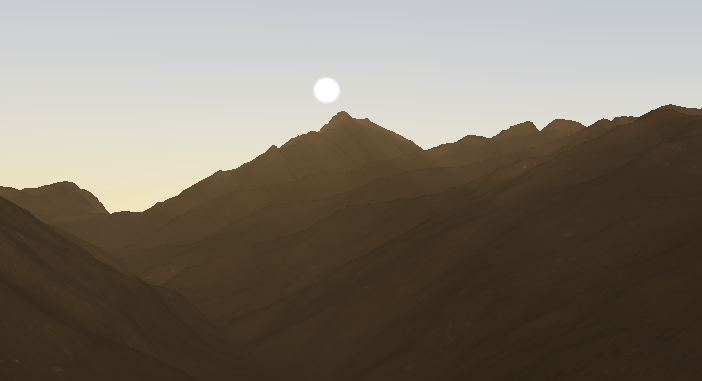

# EchoEngine

A modern 3D rendering engine built with C++20 and OpenGL 4.6, demonstrating physically-based rendering (PBR) techniques with a deferred rendering pipeline (and forward for transparent objects)



## Features

### Rendering Pipeline
- **Deferred / Forward**: Opaque objects use deferred shading; transparent objects use forward rendering
- **Physically-Based Rendering**: Cook-Torrance BRDF with metallic-roughness workflow
- **Image-Based Lighting**: Environment cubemap, irradiance map, prefilter map, BRDF LUT
- **Screen-Space Ambient Occlusion**: Kernel-based SSAO with bilateral blur
- **Skybox Rendering**: Environment cubemap with seamless transitions
- **Atmosphere Rendering**: Single and Multi scattering atmospheric rendering using LUTs
- **Shadow mapping**: Shadow mapping & volumetric shadowing

### Asset Management
- **OBJ/MTL Model Loading**: Full support for Wavefront OBJ format with material libraries
- **Texture Loading**: PNG/JPG support via STBImage
- **Resource Caching**: Lazy loading and GPU upload on-demand

### Tools & Debugging
- **Debug UI**: ImGui-based scene inspector and texture debugger
- **Performance Monitor**: Real-time FPS counter and frame time graph
- **Hot Reloading**: Live shader reloading with R key
- **GPU Texture Debugger**: Visualize G-Buffer targets, SSAO outputs, and material cache


<br>
<br>

Atmosphere is currently missing proper irradiance and specular
|                      |                      |
|----------------------|----------------------|
| Morning | Noon    |
|  |  |
| Night   | Volumetric shadowing (lightshafts) |
|  |  |

## Quick Start

### Prerequisites
- C++20 compatible compiler (GCC 10+, Clang 12+, MSVC 2019+)
- CMake 3.16 or higher
- OpenGL 4.6 compatible graphics driver

### Building

#### Linux/macOS
```bash
git clone https://github.com/Auria-dev/EchoEngine.git
cd EchoEngine
chmod +x run.sh
./run.sh
```

#### Windows
```batch
git clone https://github.com/Auria-dev/EchoEngine.git
cd EchoEngine
run.bat
```

#### Manual Build
```bash
mkdir build && cd build
cmake .. -G Ninja
ninja
./EchoEngine
```

## Controls

| Action | Key |
|--------|-----|
| Move Forward | W |
| Move Backward | S |
| Move Left | A |
| Move Right | D |
| Move Up | Space |
| Move Down | Left Shift |
| Toggle Cursor | Enter |
| Fullscreen | F11 |
| Reload Shaders | R |
| Quit | Escape |

## Dependencies

| Library | Version | Purpose |
|---------|---------|---------|
| GLFW | 3.x | Window creation and input handling |
| Glad | - | OpenGL 4.6 function loader |
| GLM | - | Mathematics library for 3D graphics |
| ImGui | Docking Branch | Debug UI and scene inspector |
| STBImage | - | Image loading (PNG/JPG) |


> All "heavy" (large) models are from [jvm-graphics-labs/awesome-3d-meshes](https://github.com/jvm-graphics-labs/awesome-3d-meshes/)


All contributions are welcome! Please feel free to submit issues and pull requests.

## License

This project is provided as-is for educational and demonstration purposes.

---

> GLAD configuration used: [glad.dav1d.de](https://glad.dav1d.de/#language=c&specification=gl&api=gl%3D4.6&api=gles1%3Dnone&api=gles2%3Dnone&api=glsc2%3Dnone&profile=compatibility&loader=on)
